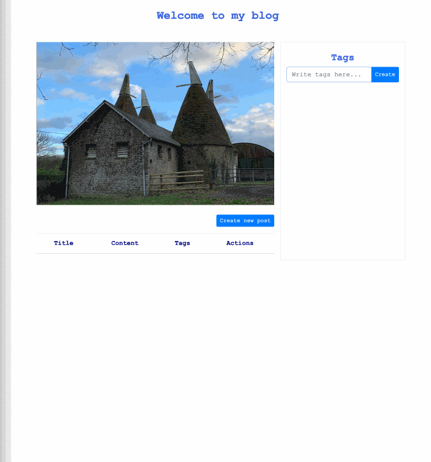

# Spring Boot Blog Application

[](https://github.com/fatmakahveci/SpringBoot-BlogApp/actions/workflows/maven.yml)
[](https://github.com/fatmakahveci/SpringBoot-BlogApp/actions/workflows/security.yml)
[](https://adoptium.net/)
[](https://spring.io/projects/spring-boot)
[](#testing-and-code-quality)
[](LICENSE.md)

A secure, server-rendered blog platform built with Spring Boot, Thymeleaf, Spring Security, and SQLite. The application combines an accessible web interface with a documented, read-only JSON API and includes production-oriented testing, observability, containerization, and CI security controls.

## Highlights

- Draft and published post workflow with stable, slug-based URLs
- Tag management, full-text title search, sorting, and pagination
- Self-service author registration and role-based authorization
- Responsive, accessible Thymeleaf interface with explicit empty states
- Consistent HTML and JSON responses for validation and application errors
- OpenAPI documentation and Swagger UI for the JSON API
- Versioned SQLite schema management with Flyway
- Actuator health probes and structured ECS production logs
- Multi-stage, non-root Docker image with read-only runtime support
- Automated tests, coverage enforcement, static analysis, and security scanning

## Application preview



The walkthrough is generated from the current application and shows the branded public feed, post discovery, sign-in, authoring, and published-post experience. The interface is keyboard accessible and adapts to phone, tablet, and desktop viewports.

The main workflow is straightforward:

1. Browse, search, sort, and filter published posts without signing in.
2. Open a post through its permanent public URL.
3. Register or sign in as an author to create drafts, publish content, and assign tags.
4. Sign in as an administrator to manage all content, including deletions.

## Technology stack

| Area | Technology |
|---|---|
| Application baseline | Java 21, Spring Boot 4.1 |
| Container toolchain | Eclipse Temurin 25 JDK/JRE |
| Web | Spring MVC, Thymeleaf, Bootstrap 5 |
| Security | Spring Security, CSRF protection, security headers, role-based access |
| Persistence | Spring Data JPA, SQLite, Flyway |
| API documentation | springdoc-openapi, Swagger UI |
| Observability | Spring Boot Actuator, health probes, ECS JSON logs |
| Quality | JUnit 6, MockMvc, JaCoCo, SpotBugs, Spotless |
| Delivery | Maven Wrapper, Docker, GitHub Actions, CodeQL, Trivy, Dependabot |

## Quick start

### Requirements

- Java 21 or later
- Git

Maven does not need to be installed; the repository includes Maven Wrapper.

```bash
git clone https://github.com/fatmakahveci/SpringBoot-BlogApp.git
cd SpringBoot-BlogApp
./mvnw spring-boot:run
```

Open [http://localhost:8080](http://localhost:8080).

On Windows, run `mvnw.cmd spring-boot:run` instead. The application uses the `dev` profile by default and stores local data in `sample.db`.

When development passwords are not provided, the application generates temporary administrator and author passwords and writes them once to the startup log. For predictable local credentials, start the application with explicit values:

```bash
BLOG_ADMIN_PASSWORD='replace-with-a-strong-password' \
BLOG_AUTHOR_PASSWORD='replace-with-a-different-password' \
./mvnw spring-boot:run
```

## Roles and permissions

| Capability | Public | Author | Administrator |
|---|:---:|:---:|:---:|
| Browse published posts | Yes | Yes | Yes |
| Register and sign in | Yes | Yes | Yes |
| View drafts | No | Yes | Yes |
| Create and edit content | No | Yes | Yes |
| Delete posts and tags | No | No | Yes |

Administrator password authentication is followed by mandatory TOTP verification. On first sign-in, add the displayed setup key to an authenticator application and enter its current six-digit code. Subsequent administrator sessions remain restricted until the second factor succeeds.

## Configuration profiles

| Profile | Purpose | Notable behavior |
|---|---|---|
| `dev` | Local development; selected by default | Uncached templates and generated temporary passwords |
| `test` | Automated test execution | Isolated in-memory SQLite database and deterministic credentials |
| `e2e` | Playwright browser tests | Isolated in-memory database, stable credentials, concise logs |
| `staging` | Pre-production deployment | Production security with an independent database and Sentry environment |
| `prod` | Container and production deployments | Required secrets, secure cookies, structured logs, cached templates |
| `redis` | Optional shared cache; combine with another profile | Redis-backed sitemap cache with bounded timeouts and TTL |

The staging and production profiles each require their own `BLOG_DATABASE_PATH`, account passwords, base URL, and MFA encryption values. They fail fast when required secrets are missing. Never point staging at the production database or reuse its secrets.

### Environment variables

| Variable | Development default | Description |
|---|---|---|
| `SPRING_PROFILES_ACTIVE` | `dev` | Active runtime profile |
| `BLOG_DATABASE_PATH` | `sample.db` | SQLite database path; required in production |
| `BLOG_ADMIN_USERNAME` | `admin` | Initial administrator username |
| `BLOG_ADMIN_PASSWORD` | Generated | Initial administrator password; required in production |
| `BLOG_AUTHOR_USERNAME` | `author` | Initial author username |
| `BLOG_AUTHOR_PASSWORD` | Generated | Initial author password; required in production |
| `BLOG_MFA_KEY` | Development-only value | High-entropy key used to encrypt TOTP secrets; required in production |
| `BLOG_MFA_ENCRYPTION_SALT` | Development-only value | Stable random hexadecimal salt for MFA encryption; required in production |
| `SPRINGDOC_ENABLED` | `false` in production | Enables Swagger UI and OpenAPI endpoints in production |
| `BLOG_BASE_URL` | `http://localhost:8080` | Public HTTPS origin used for canonical URLs and the sitemap; required in production |
| `BLOG_VERSION` | Maven project version | Release value attached to logs and Sentry events |
| `SENTRY_DSN` | Disabled | Enables Sentry error and performance reporting when configured |
| `SENTRY_ENVIRONMENT` | `production` | Sentry environment name |
| `SENTRY_TRACES_SAMPLE_RATE` | `0.1` | Production transaction sampling rate from `0.0` to `1.0` |
| `BLOG_SECURITY_SCANNER_ADDRESSES` | Empty | Comma-separated trusted scanner source addresses; never inferred from User-Agent |
| `REDIS_HOST` | `localhost` | Redis host used when the `redis` profile is active |
| `REDIS_PORT` | `6379` | Redis port used when the `redis` profile is active |
| `REDIS_PASSWORD` | Empty | Redis password; supply it through the deployment secret store |
| `REDIS_SSL` | `false` | Enables TLS for the Redis connection |
| `BLOG_CACHE_TTL` | `10m` | Maximum lifetime of a cached sitemap |

Flyway applies migrations from `src/main/resources/db/migration`. Add a new migration for each schema change; never modify a migration that has already been deployed.

The application uses an in-process cache by default. Set `SPRING_PROFILES_ACTIVE=prod,redis` to share the sitemap cache across instances. Successful post and topic mutations evict the complete sitemap cache, while the TTL provides a recovery bound if an external write bypasses the application.

## API and operational endpoints

After starting the application locally:

| Endpoint | Purpose |
|---|---|
| [Swagger UI](http://localhost:8080/swagger-ui.html) | Interactive API documentation |
| [OpenAPI JSON](http://localhost:8080/v3/api-docs/blog-api) | Machine-readable API specification |
| [Health](http://localhost:8080/actuator/health) | Sanitized aggregate status for operators |
| [Readiness](http://localhost:8080/actuator/health/readiness) | Traffic readiness, including the application state and SQLite connectivity |
| [Liveness](http://localhost:8080/actuator/health/liveness) | Process health without external dependency checks |
| [Application](http://localhost:8080) | Server-rendered blog interface |
| [Sitemap](http://localhost:8080/sitemap.xml) | Canonical URLs for published posts and public topics |
| [Robots](http://localhost:8080/robots.txt) | Search crawler policy and sitemap discovery |

Only the Actuator `health` and `info` endpoints are exposed over HTTP. Health component details and sensitive management endpoints remain unavailable to public clients. In production, use readiness to decide when to route traffic and liveness to decide when to restart the process; do not use readiness failures as a restart signal.

Every response includes an `X-Request-ID`. A safe client-provided value is preserved; otherwise the application generates one. Secure-environment ECS logs attach the request ID, authenticated username, service version, environment, response status, and request duration. Setting `SENTRY_DSN` enables sanitized error and performance reporting with matching request, user, version, and environment tags; default personally identifiable information collection remains disabled. Invalid trace sampling values fail during startup.

### JSON API examples

```bash
curl "http://localhost:8080/api/posts?page=0&size=10&sort=newest"
curl "http://localhost:8080/api/posts?query=spring&sort=titleAsc"
curl http://localhost:8080/api/tags
```

Anonymous API clients only receive published posts. Authenticated authors and administrators may also retrieve drafts.

API failures use a consistent representation for `400 Bad Request`, `404 Not Found`, and `409 Conflict` responses:

```json
{
  "timestamp": "2026-08-02T21:00:00Z",
  "status": 404,
  "error": "Not Found",
  "message": "Could not find post missing",
  "path": "/api/posts/missing"
}
```

Equivalent browser failures render an accessible HTML error page.

## Docker

The multi-stage Dockerfile compiles the application and produces a minimal image with a fixed unprivileged UID. The recommended Compose configuration enforces the complete runtime policy:

```bash
export BLOG_ADMIN_PASSWORD='replace-with-a-strong-password'
export BLOG_AUTHOR_PASSWORD='replace-with-a-different-password'
# Also set BLOG_MFA_KEY and BLOG_MFA_ENCRYPTION_SALT.
docker compose up --build
```

SQLite data is stored in the `blog-data` volume. The container runs as UID/GID `10001`, with a read-only root filesystem, all Linux capabilities dropped, `no-new-privileges`, a PID limit, and a small `noexec` temporary filesystem. A separate 16 MB tmpfs is executable only because SQLite JDBC must load its native library; application temporary files and persisted data remain `noexec`. The Security Dashboard boots the image under this exact policy, waits for the readiness probe, and fails if the user or read-only runtime is broken. Docker monitors the dependency-independent liveness probe with `wget`.

The build stage uses Eclipse Temurin 25 JDK on Alpine. The runtime uses the glibc-based Eclipse Temurin 25 JRE on Ubuntu Noble because SQLite JDBC requires a compatible native library. Only CA certificates and `wget` are installed in the runtime image; package upgrades are applied during the image build.

## Testing and code quality

Run the complete verification pipeline:

```bash
./mvnw clean verify
```

This command runs:

- Unit, MVC, security, repository, migration, and real SQLite integration tests
- Spotless source formatting checks
- SpotBugs static analysis
- JaCoCo coverage reporting and the configured coverage threshold
- Spring Boot executable JAR packaging

The coverage report is generated at `target/site/jacoco/index.html`. Tests use isolated in-memory SQLite databases and never modify the repository's `sample.db` file.

Frontend unit and browser tests require Node.js 24:

```bash
npm ci
npm run test:frontend
npx playwright install chromium
npm run test:e2e
```

JaCoCo enforces 85% line and instruction coverage and 65% branch coverage. Vitest enforces the frontend thresholds configured in `vitest.config.js`. CI uploads both coverage reports and the Playwright report as short-lived workflow artifacts.

## Architecture

```text
Browser ──> MVC controllers ──> Thymeleaf views
Client  ──> REST controllers ─> JSON responses
                 │
                 v
              Services ──> Repositories ──> SQLite
                              │
                              └────────────> Flyway migrations
```

- Controllers handle transport concerns and delegate business behavior.
- Services define transactional boundaries and enforce application rules.
- Entities maintain both sides of bidirectional relationships safely.
- Repositories provide persistence without leaking database access into views.
- Lazy relationships use bounded batch loading, while Flyway indexes cover published-post and reverse topic lookups.
- A global exception handler produces consistent HTML and JSON failures.

## Security and CI

The application and repository include:

- Password hashing through Spring Security's delegating password encoder
- Mandatory administrator TOTP with AES-GCM encrypted secrets
- Append-only administrator audit records for successful state-changing requests
- Role-aware request limits with strict authentication throttles and trusted scanner allowlisting
- CSRF protection, secure session settings, CSP, referrer, permissions, and frame restrictions
- Role-based write and delete authorization
- Validation and database constraints for duplicate and malformed data
- GitHub dependency review for pull requests
- Dependabot vulnerability alerts and automated security updates
- CodeQL static security analysis
- Trivy container vulnerability scanning
- Secret scanning with push protection
- Hardened container startup verification under the production runtime policy
- Weekly Dependabot updates for Maven, GitHub Actions, and Docker

The Java CI and Security Dashboard workflows run on every pull request and every push to `main`. Changes should not be merged until required build, frontend/E2E, dependency, CodeQL, and container checks pass.

The scheduled Disaster Recovery workflow creates an online SQLite backup, deliberately changes the source database, restores the backup to a clean path, boots the restored application, and verifies a known record through the public API. Operators can use `scripts/backup-sqlite.sh` and `scripts/restore-sqlite.sh`; both commands reject invalid input and run SQLite integrity checks.

## Contributing

Read [CONTRIBUTING.md](CONTRIBUTING.md) for development, testing, and pull-request requirements. Security issues must be reported privately according to [SECURITY.md](SECURITY.md). Release history and maintainer procedures are documented in [CHANGELOG.md](CHANGELOG.md) and [RELEASING.md](RELEASING.md).

Deployment owners should follow the [operations runbook](docs/OPERATIONS.md) for environment isolation, health semantics, verified backup and restore, incident correlation, and rollback.

## License

Licensed under the [Apache License 2.0](LICENSE.md).
